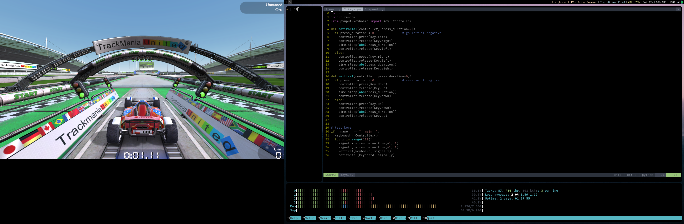

## DriveForever

This program that creates a gym environment for for Nadeo TrackMania Nations Forever game.
- This is work is based on the tmrl https://pypi.org/project/tmrl/ project.
- Ported for linux only

----------------------------------------------------------------- 

----------------------------------------------------------------- 

## Dependencies
- pynput
- rtgym
- gym
- opencv
## TODO
- Add a learning agent
- make program faster, right now each timestep takes 1 second.
- change reward function to something more fancy
- create for passing stages like finish and checkpoint 
